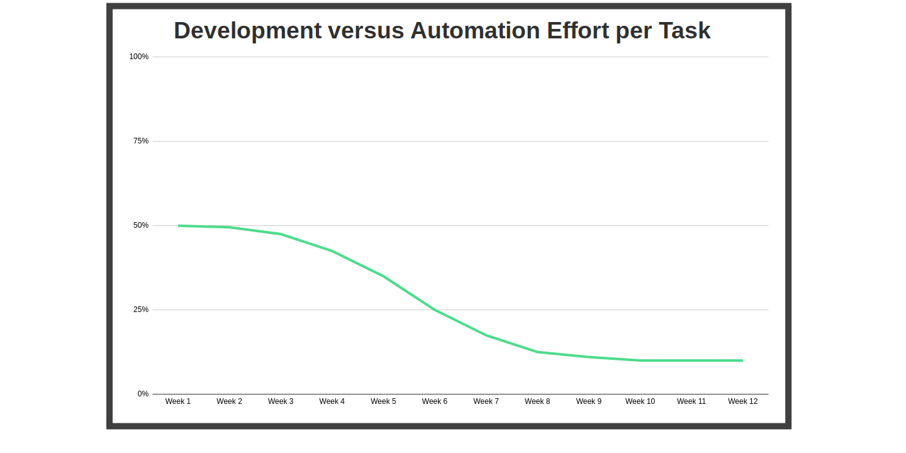
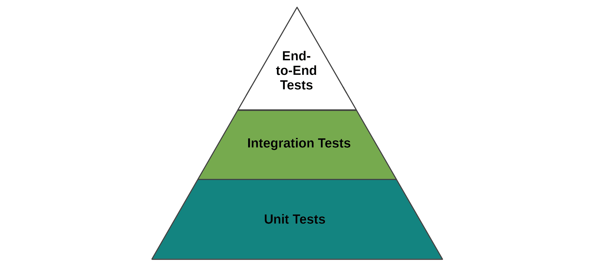

# Chapter 1: Introduction to Automation

At one time, software was validated the same way that any other product was tested, by hand. Considering that the primary reason people and companies use software to begin with is to automate repetitive tasks, it makes a lot of sense to automate the testing of that software. While I don't believe that automation can fully replace manual testing, having robust and well-maintained automated tests can improve the quality of your applications while also making your team more efficient, productive, and happy.

## 1.1 Why Automate Testing?

While manual testing can provide value in certain cases, the sheer size and complexity of modern applications requires some level of automation to properly validate functionality if products of quality are to be delivered to customers within a reasonable time frame. That being said, one of the primary reasons to automate your testing is to actually allow yourself to do more manual testing but with an exploratory focus. I am a supporter of letting computers do what they do best (boring and repetitive tasks) in order to free up humans to do what it is that we do best (identify patterns, make judgments, explore, etc.). Automated testing doesn't replace manual testing, so instead we should be using both techniques to improve the quality of software, which is the ultimate goal of any QA effort.

Many years ago, I worked on a software project that involved a third-party vendor converting our legacy mainframe code into {{C\#}}. I was in charge of reviewing their delivered builds and tracking bugs, and we had several people on the team dedicated to manual testing. Every week or two, the vendor would send over the latest build, I'd install it onto our servers, and then the testing team would spend the next four or five days running through their manual test procedures. Afterward, we'd collect the results of those manual tests and send a report back to the vendor in order for them to make changes. This process went on for months and was extremely stressful for everyone on the team, especially because there was significant pressure from our government customer to deliver a final product quickly. Even worse, sometimes the latest build from the vendor would be less usable than the previous one. If we had created automated tests written to perform at least a surface-level check of the vendor's builds, a lot of time and stress could have been avoided. Computers don't get tired, and they don't experience emotional stress (except perhaps for Google's AI chatbot^[https://time.com/6186990/google-ai-bot-sentient-lamda/]), so leveraging automation to handle those aspects of the validation process is ideal for meeting customer delivery dates while keeping the people on your team happy.

\pagebreak
Every time the source code of your application changes, any previous test results become invalid especially if (as in the previous example) some or all of the components are outside of your team's control. Considering that the vast majority of applications are built on top of frameworks and libraries that we casually download from the internet with {{NPM}}, {{Maven}}, {{gem}}, {{pip}}, etc., most of the actual code being executed as part of a modern application is no longer within our control or the control of a single well-known vendor such as {{Oracle}} or {{Microsoft}}. This can lead to unexpected bugs or even security vulnerabilities such as {{CVE-2021-44228}}^[https://nvd.nist.gov/vuln/detail/CVE-2021-44228] or the {{NPM colors attack}}^[https://news.ycombinator.com/item?id=29877745] and can cause significant impacts to your software.

To respond to these challenges, it is more important than ever to have test automation in place that can allow you to quickly assess if the behavior of your application has changed. Considering the worth of your team's time and mental health, investing in test automation will yield more value than repeatedly testing software manually and then starting from scratch every time there's a change to your application. If your application is small, doesn't integrate with any other systems, and never changes, then automation may not make sense for you. For all other cases which includes almost all modern software applications, pursuing test automation is a worthwhile endeavor.

Once you have built some automated tests for your application, those tests can then become part of a larger infrastructure collectively referred to as {{Continuous Integration}} and {{Continuous Delivery}} or {{CI/CD}}. The more often you run your tests and can begin to depend on them, the more confidence you will gain regarding your tests as well as in the behavior of your entire application. For more detailed information on {{CI/CD}}, skip ahead to **Chapter 2**.

## 1.2 Opportunity Cost

Test automation is an investment, and like any other type of investment there is an upfront cost. At the beginning of your project which is incorporating test automation, the investment will be considerable until you've accumulated a sufficient collection of reusable test steps. You can expect to be spending 50% of total effort on automation for every work item in the first several weeks of development. But as you build up your library of reusable test steps, the amount of effort required for writing new tests will drop significantly. If you made good design choices at the beginning, you will be able to quickly write new automated tests for your software project with little to no coding required. Throughout this book, we will be reviewing strategies and examples on how to accomplish this.

\pagebreak

If you work on many similar and closely related software projects, it may be possible for you to reuse your steps across multiple projects, assuming you choose to design your steps with that in mind. The more time and effort you invest up front into your automation architecture, the more value you receive from it in return over time.

## 1.3 Measurable Goals

When planning a significant development effort such as implementing and maintaining automated testing, it is important to consider what your team's goals are. In general, the primary objective of any software QA team is to ensure that software of the highest quality is being delivered to customers within a reasonable amount of time. When customers receive software products riddled with defects that impact their productivity, the reputation and future viability of your product is in peril. That said, it is difficult to prioritize your team's testing efforts without first determining what the desired outcome is. For example, your product may be subject to industry-specific legal compliance requirements so automating this required testing would be a sensible goal. Other target goals include reducing the number of defects, reducing production outages, or reducing the amount of scripted manual testing.

When considering your goals, remember that every time a piece of software is changed, the previous test results for that software are no longer valid. Also consider that tracking defects and where they originate from is helpful for measuring progress and ultimately improving the quality of software.

\pagebreak

## 1.4 The Testing Pyramid

This wouldn't be a book about testing without the {{Testing Pyramid}}.

There are a lot of variations of this model in books and on the internet. Some of them have four or five layers, or sometimes it's rendered in 3D, so it's actually a pyramid instead of just a triangle. In any case, the intent of this model is to provide a visual reference for what types of tests you should be writing and how much emphasis you should be putting on each of those types. Essentially it says that you should have unit tests for covering all of your software components, you should have a significant amount of testing the integration between components such as your service layer, and finally some but not all of your testing should be focused on testing your entire application (end-to-end) such as UI testing. However, in my opinion having a few outstanding tests is much better than 100% code coverage with poor {{unit testing}} creating a false sense of safety.

This diagram makes a lot of assumptions by drawing lines between what {{unit testing}}, {{integration testing}}, and {{end-to-end testing}} are. Unfortunately, reality is not quite that simple. For example, while the difference between a {{service testing}} and {{UI testing}} would seem straightforward, there are some specific types of services such as {{BFF}}s that have testing characteristics of both. We'll talk more about {{BFF}}s in **Chapter 2**.

In an effort to eliminate the ambiguity, some versions of this model have done away with well-defined sections and instead use a gradient where the farther up the pyramid you go the more integration between components is involved in the tests. Unit tests have no integration, integration tests have some amount of integration, and end-to-end tests have full integration with your application's various components and systems.
